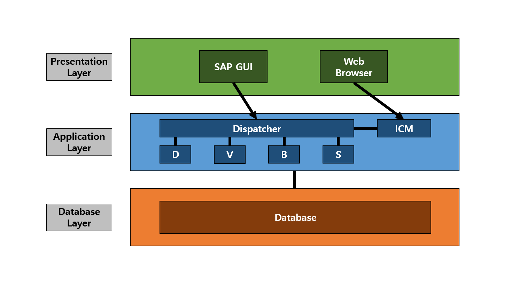
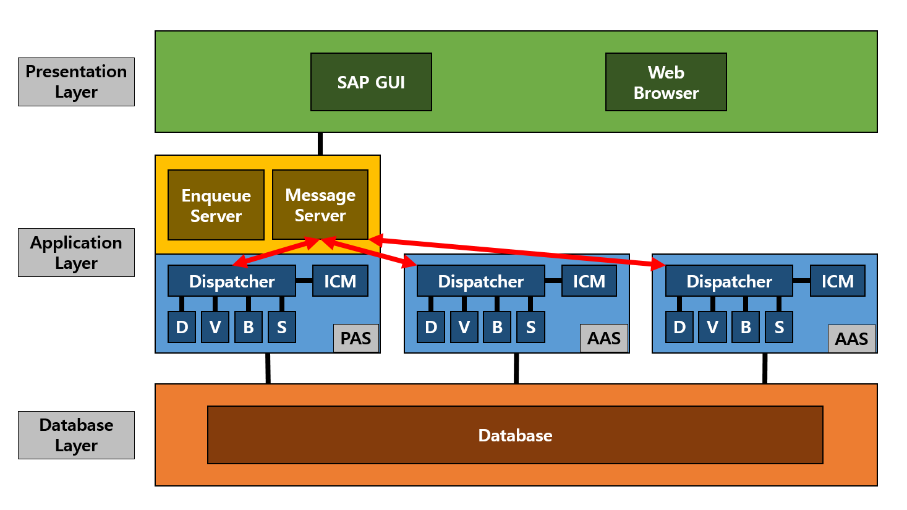
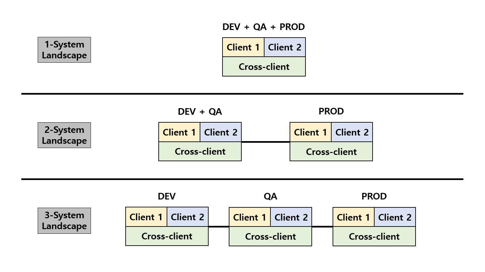

# SAP BC

목차 및 링크

> [1. SAP란?](https://github.com/KaJaeHyeob/SAP_BC#1-sap%EB%9E%80)    
> > [1) SAP](https://github.com/KaJaeHyeob/SAP_BC#1-sap)    
> > [2) ERP](https://github.com/KaJaeHyeob/SAP_BC#2-erp)    
> > [3) SAP ERP System Layer](https://github.com/KaJaeHyeob/SAP_BC#3-sap-erp-system-layer)    
> > [4) SAP ERP System Landscape](https://github.com/KaJaeHyeob/SAP_BC#4-sap-erp-system-landscape)    
> 
> [2. BC란?](https://github.com/KaJaeHyeob/SAP_BC#2-bc%EB%9E%80)    
> > [1) BC](https://github.com/KaJaeHyeob/SAP_BC#1-bc)    
> > [2) BC 업무](https://github.com/KaJaeHyeob/SAP_BC#2-bc-%EC%97%85%EB%AC%B4)    

## 1. SAP란?

### 1) SAP

 "System & Application & Products in data processing"의 약어로, 업무용 솔루션 제작 회사이다.    
 우리가 흔히 말하는 SAP는 사실상 "SAP ERP"라는 SAP사의 ERP 제품 이름이다.    

### 2) ERP

 "Enterprise Resource Planning"의 약어로, 전사적 자원 관리를 의미하며, 회사의 모든 자원을 관리하는 시스템이다.    

### 3) SAP ERP System Layer

 SAP ERP 하나의 시스템 안에는 3계층 구조로 이루어져있다.    
 Presentation Layer에서 사용자가 어떠한 이벤트를 발생시키면 Application Layer가 작동되며, Application Layer에선 Database Layer에 데이터를 요청하여 특정 작업을 수행한다.   
 더 자세한 작동방식이 궁금하다면, 아래의 "더보기"란을 참고하면 되겠다.   

더보기

>  3계층 중에서 어렵게 느껴질 수도 있는 부분인 Application Layer에 대해서 좀 더 자세하게 작성해보도록 하겠다.    
>  BC 직무가 아니라면 굳이 볼 필요 없는 부분이다.    
> 
>  Application Layer의 중요한 구성요소 두 가지는 DP(Dispatcher), WP(Work Process)이다.    
>  DP는 사용자가 발생시킨 이벤트와 부합하는 WP로 해당 작업을 분배시키는 역할을 한다.    
>  WP는 각 작업을 수행하는 프로세스로, 대표적으로 DVBS 네 가지 유형이 존재한다.    
>  - D : "Dialog WP"의 약자로, 대부분의 조회 또는 연산 작업을 수행    
>  - V : "Update WP"의 약자로, Database 업데이트에 관한 작업을 수행    
>  - B : "Background WP"의 약자로, 작동 프로그램 및 변수와 실행시각 등을 설정하여 사용자와 추가적인 상호작용이 필요없는 작업을 수행    
>  - S : "Spool WP"의 약자로, 출력 요청 시 데이터를 프린터에 전달하는 작업을 수행    
> 
>  위의 내용은 하나의 Application Server를 사용한다는 가정하에 작성한 것이고, 서버가 여러 대일 경우에는 조금 더 복잡해진다.    
> 
> 
> 
>  서버가 여러 대일 경우에는 ASCS(ABAP System Central Service)가 락 테이블 관리 및 로드밸런싱 관리 역할을 해주는데, ASCS를 포함하는 하나의 서버를 PAS(Primary Application Server)라 하고, 그 외 나머지 서버들을 AAS(Additional Application Server)라고 한다.    
>  ASCS의 ES(Enqueue Server)에서는 서버간의 락을 방지하기 위해 통합 락 테이블을 관리하고, MS(Message Server)에서는 서버들의 DP와 통신하면서 로드밸런싱을 관리한다.    
> 
>  - 사실 SAP사에서 PAS와 ASCS를 완벽히 분리시켰기 때문에, PAS와 AAS 둘 사이에는 전혀 차이가 없다고 한다. 하지만, NetWeaver 7.0 이하 버전까지는 현재의 PAS와 ASCS가 합쳐진 CI(Central Instance), 현재의 AAS인 DI(Dialog Instance) 개념을 사용했기 때문에 대부분의 사용자들이 PAS와 AAS 둘을 구별하여 사용한다.    

### 4) SAP ERP System Landscape

 위에서 하나의 시스템 내에 존재하는 3계층 구조를 살펴보았다면, 이번에는 이 시스템을 몇 개 사용해야 적당한가에 대해서 말해보고자 한다.    
 대부분의 사용자는 하나의 시스템만을 사용하지 않고, 여러 시스템을 구축해둔다. 주된 목적은 안정성이다. 운영 중인 시스템 내에 문제가 생기지 않도록, 다른 시스템에서 개발 및 테스트를 진행함으로써 안정성을 확보한다. SAP사에서 권장하는 건 3-System Landscape이다.    

 - 3-System Landscape : 개발, 테스트, 운영 목적으로 3개의 시스템을 구축해 사용
 - 2-System Landscape : 개발+테스트, 운영 목적으로 2개의 시스템을 구축해 사용
 - 1-System Landscape : 개발+테스트+운영 목적으로 1개의 시스템을 구축해 사용

 각각의 시스템을 개별로 구축하여 개발 및 테스트를 거친 후 운영 시스템에 반영하는 방식인 3-System Landscape 또는 2-System Landscape가 주로 사용되며, 1-System Landscape은 거의 사용되지 않는 편이다.    

-----

## 2. BC란?

### 1) BC

 직무명으로써의 BC는 "Basis Consultant"의 약어로, SAP ERP의 관리자를 의미하며, 모든 시스템 환경을 총괄하는 역할을 맡는다.    
 모듈명의로써의 BC는 "Basis Component"의 약어로, BC 직무를 수행하기 위한 SAP ERP 내의 코어 모듈이다.    
 "모듈"이라는 것은 SAP ERP 내의 주요 업무 분장에 따라 나눠놓은 프로그램 모음이라고 생각하면 이해하기 쉽다. 모듈 목록은 "더보기"란에 작성해두겠다.    

더보기

  

>  코어 모듈
>  - MM : "Material Management"의 약어로, 구매 및 자재 관리 모듈
>  - PP : "Production Planning"의 약어로, 생산 관리 모듈
>  - SD : "Sales and Distribution"의 약어로, 영업 및 유통(물류) 관리 모듈
>  - FI : "Financial"의 약자로, 재무 회계 모듈 (외부 보고용 회계)
>  - CO : "Controlling"의 약자로, 관리 회계 모듈 (내부 전략용 회계)
>  - HR : "Human Resources"의 약어로, 인사 관리 모듈
>  - BW : "Business Warehouse"의 약어로, 데이터 관리 모듈
>  - BI : "Business Intelligence"의 약어로, 데이터 분석 및 리포팅 모듈
> 
>  서브 모듈
>  - QM : "Quality Management"의 약어로, 품질 관리 모듈
>  - IM : "Investment Management"의 약어로, 수출입 및 투자 관리 모듈
>  - LE : "Logistics Execution"의 약어로, 재고 및 보관 관리 모듈
>  - PM : "Plant Management"의 약어로, 설비 관리 모듈
>  - TR : "Treasury"의 약자로, 자금 관리 모듈
>  - FB : "Firm Banking"의 약어로, 펌뱅킹 관리 모듈 (은행 업무)
>  - PI : "Process Integration"의 약어로, non-SAP 프로그램 데이터 연동 관리 모듈

### 2) BC 업무

 BC는 SAP ERP의 관리자로 시스템 환경을 총괄하기 때문에, 개발 업무가 주를 이루는 다른 모듈과 다르게 운영 및 관리 업무가 대부분을 차지한다.    
 주요 업무 목록은 아래와 같으며, 각 업무에 대한 메뉴얼을 작성하여 링크를 생성할 계획이다.    
