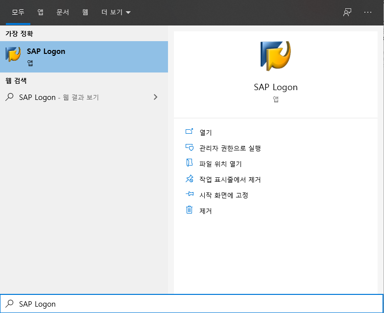
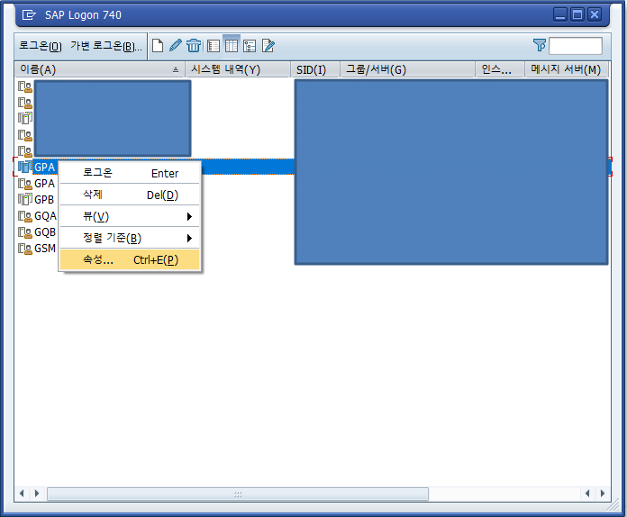
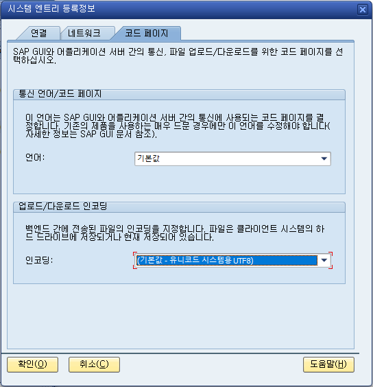

# SAP ERP 한글 깨짐 현상 조치

목차 및 링크

> [1. 개요](https://github.com/KaJaeHyeob/SAP_BC/tree/master/SAP%20%ED%95%9C%EA%B8%80%20%EA%B9%A8%EC%A7%90%20%ED%98%84%EC%83%81%20%EC%A1%B0%EC%B9%98#1-%EA%B0%9C%EC%9A%94)    
> [2. 해결방법](https://github.com/KaJaeHyeob/SAP_BC/tree/master/SAP%20%ED%95%9C%EA%B8%80%20%EA%B9%A8%EC%A7%90%20%ED%98%84%EC%83%81%20%EC%A1%B0%EC%B9%98#2-%ED%95%B4%EA%B2%B0%EB%B0%A9%EB%B2%95)    
> > [1) SAP Logon 실행](https://github.com/KaJaeHyeob/SAP_BC/tree/master/SAP%20%ED%95%9C%EA%B8%80%20%EA%B9%A8%EC%A7%90%20%ED%98%84%EC%83%81%20%EC%A1%B0%EC%B9%98#1-sap-logon-%EC%8B%A4%ED%96%89)    
> > [2) 대상 시스템 우클릭 및 속성 메뉴 클릭](https://github.com/KaJaeHyeob/SAP_BC/tree/master/SAP%20%ED%95%9C%EA%B8%80%20%EA%B9%A8%EC%A7%90%20%ED%98%84%EC%83%81%20%EC%A1%B0%EC%B9%98#2-%EB%8C%80%EC%83%81-%EC%8B%9C%EC%8A%A4%ED%85%9C-%EC%9A%B0%ED%81%B4%EB%A6%AD-%EB%B0%8F-%EC%86%8D%EC%84%B1-%EB%A9%94%EB%89%B4-%ED%81%B4%EB%A6%AD)    
> > [3) 코드 페이지 탭 클릭 및 인코딩 포맷 UTF8 변경](https://github.com/KaJaeHyeob/SAP_BC/tree/master/SAP%20%ED%95%9C%EA%B8%80%20%EA%B9%A8%EC%A7%90%20%ED%98%84%EC%83%81%20%EC%A1%B0%EC%B9%98#3-%EC%BD%94%EB%93%9C-%ED%8E%98%EC%9D%B4%EC%A7%80-%ED%83%AD-%ED%81%B4%EB%A6%AD-%EB%B0%8F-%EC%9D%B8%EC%BD%94%EB%94%A9-%ED%8F%AC%EB%A7%B7-utf8-%EB%B3%80%EA%B2%BD)    

-----

## 1. 개요

 SAP ERP 제품을 사용하다 보면 데이터를 다운로드 및 업로드하는 여러 과정에서 한글이 깨지는 현상이 나타난다. 이는 SAP GUI가 데이터를 출력할 때 사용자가 지정한 인코딩 포맷으로 변환하여 출력하기 때문이다. 따라서, 인코딩 포맷만 알맞게 변경해주면 간단하게 해결할 수 있다.    
 SAP GUI 설정은 글로벌 설정과 시스템별 설정으로 나뉘는데 인코딩은 시스템별로 설정 가능하다.    

-----

## 2. 해결방법

### 1) SAP Logon 실행

- SAP GUI 시스템별 설정을 위해 시스템 목록을 조회할 수 있는 SAP Logon 프로그램을 실행한 것이고, 글로벌 설정은 SAP GUI Configuration 프로그램에서 가능하다.    

### 2) 대상 시스템 우클릭 및 속성 메뉴 클릭

### 3) 코드 페이지 탭 클릭 및 인코딩 포맷 UTF8 변경

