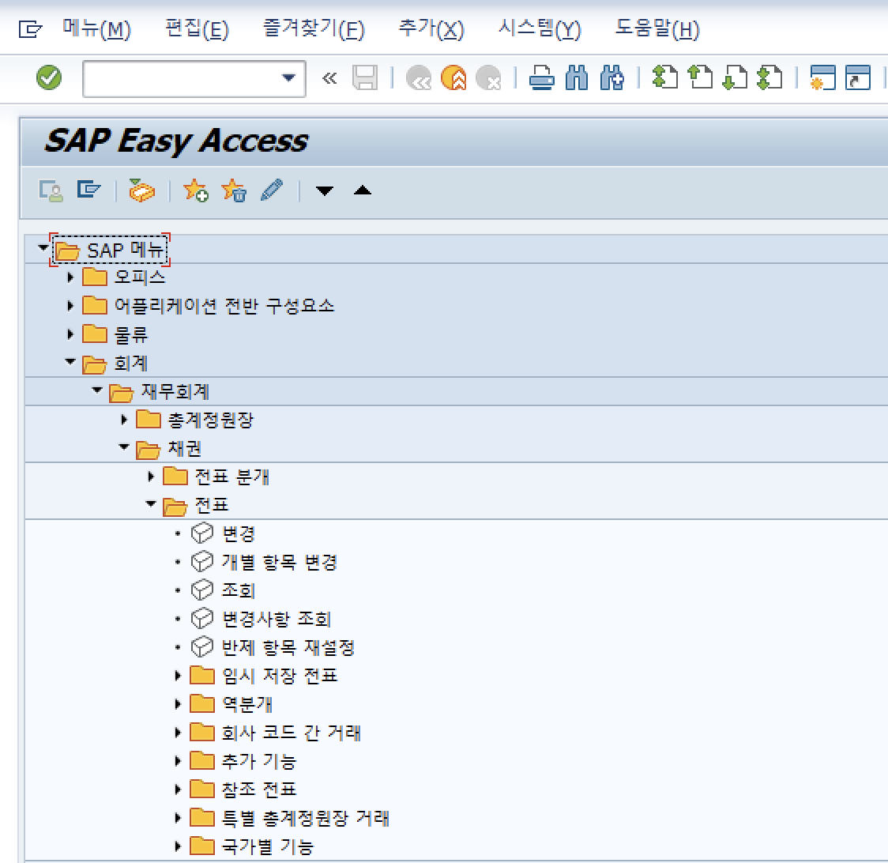
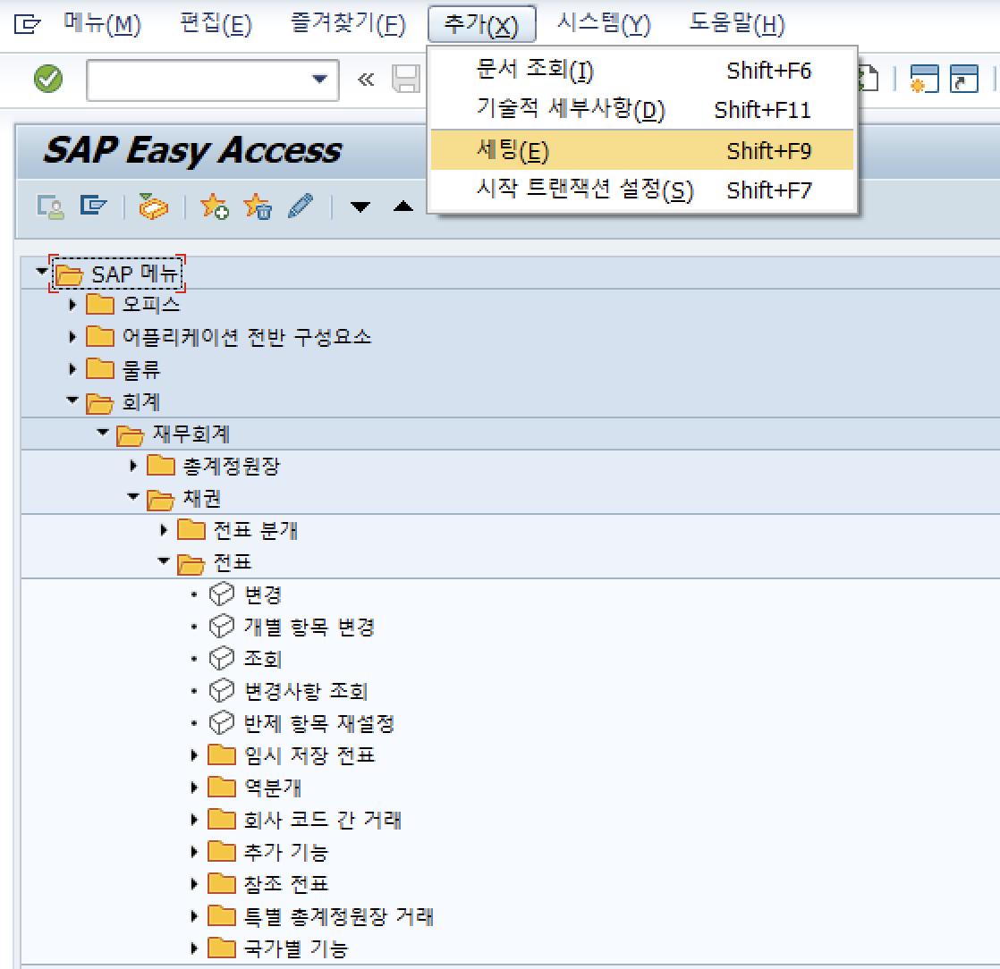
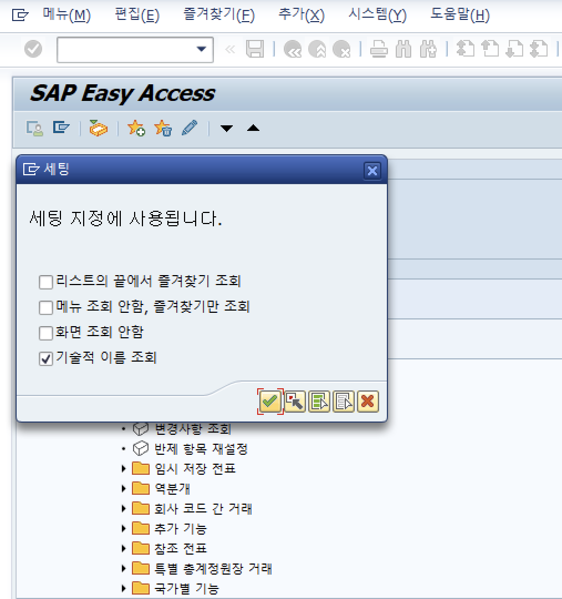
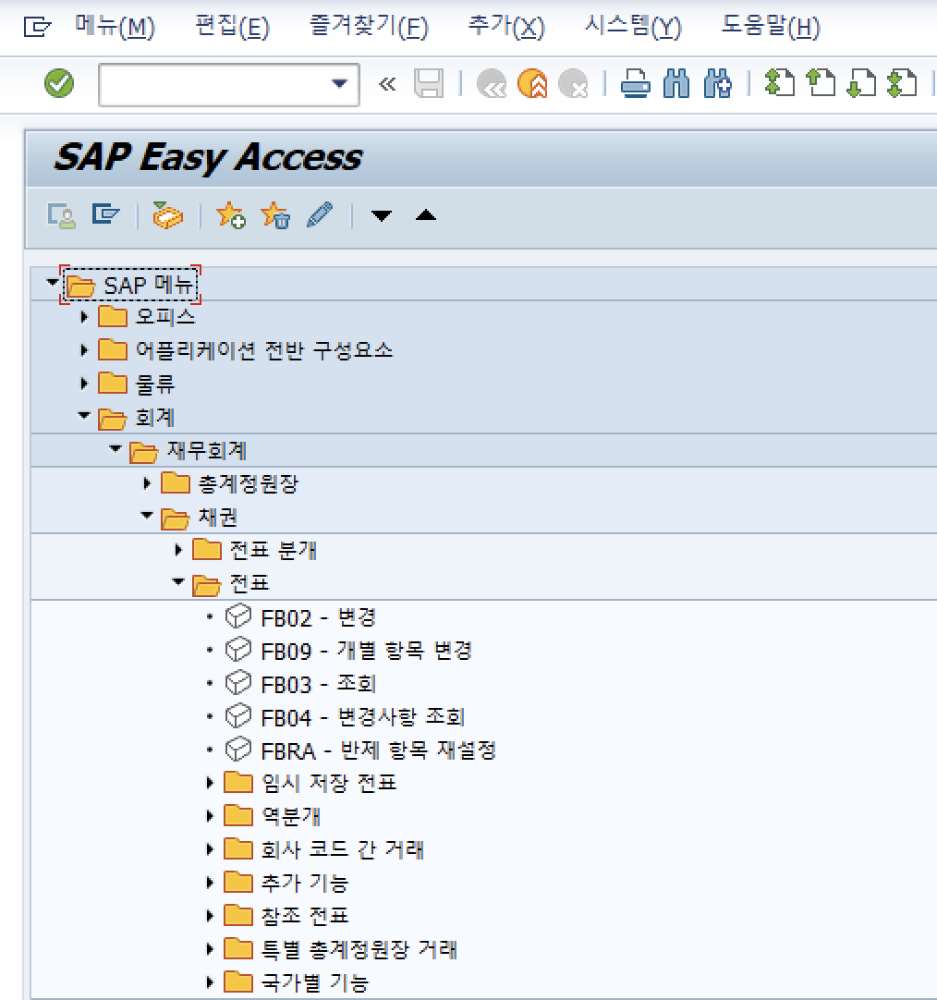

# 시작화면 T-code 출력 설정

목차 및 링크

> [1. 개요](https://github.com/KaJaeHyeob/SAP_BC/tree/master/%EC%8B%9C%EC%9E%91%ED%99%94%EB%A9%B4%20T-code%20%EC%B6%9C%EB%A0%A5%20%EC%84%A4%EC%A0%95#1-%EA%B0%9C%EC%9A%94)    
> [2. 해결 방법](https://github.com/KaJaeHyeob/SAP_BC/tree/master/%EC%8B%9C%EC%9E%91%ED%99%94%EB%A9%B4%20T-code%20%EC%B6%9C%EB%A0%A5%20%EC%84%A4%EC%A0%95#1-%EA%B0%9C%EC%9A%94)    
> > [1) 시작화면 > 추가 > 세팅 > 기술적 이름 조회 설정](https://github.com/KaJaeHyeob/SAP_BC/tree/master/%EC%8B%9C%EC%9E%91%ED%99%94%EB%A9%B4%20T-code%20%EC%B6%9C%EB%A0%A5%20%EC%84%A4%EC%A0%95#1-%EA%B0%9C%EC%9A%94)    
  

-----

## 1. 개요

 시작화면에서 T-code가 조회되지 않는 경우, 기술적 이름 조회 설정을 통해 조치 가능하다.

-----

## 2. 해결 방법    

### 1) 시작화면 > 추가 > 세팅 > 기술적 이름 조회 설정    

