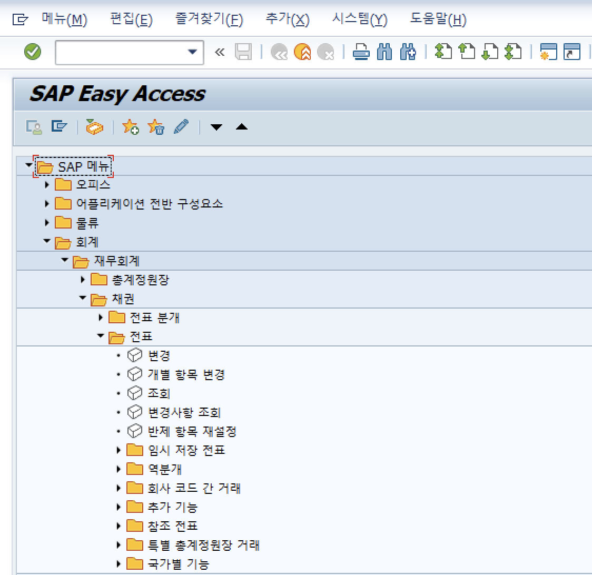
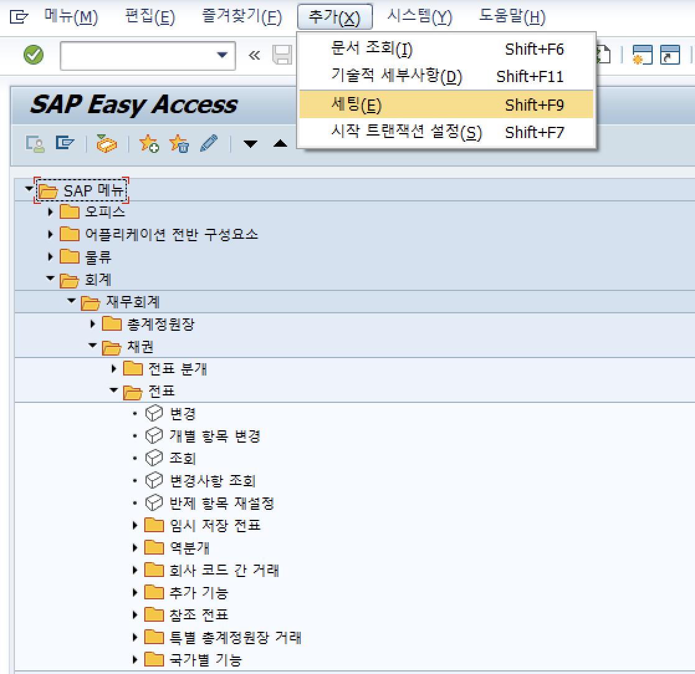
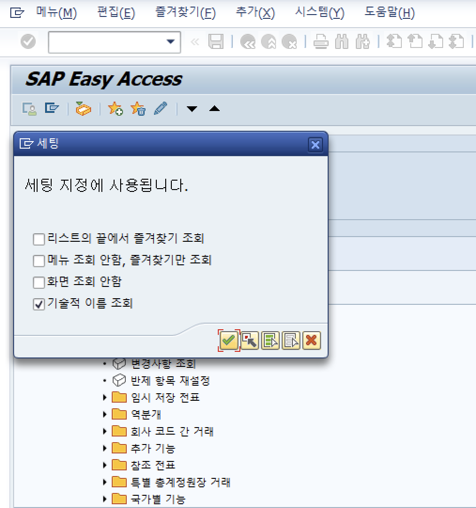
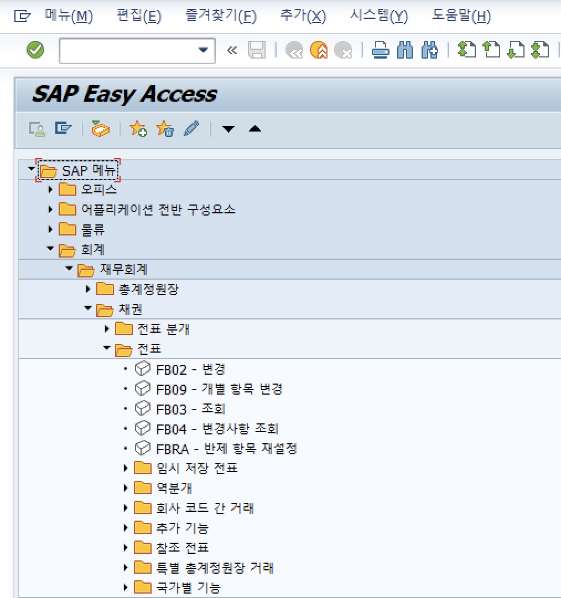

# SAP ERP 한글 깨짐 현상 조치

목차 및 링크

> [1. 개요]()    
> [2. 해결 방법]()    
> > [1) 시작화면 > 추가 > 세팅 > 기술적 이름 조회 설정]()    
  

-----

## 1. 개요

 시작화면에서 T-code가 조회되지 않는 경우, 기술적 이름 조회 설정을 통해 조치 가능하다.

-----

## 2. 해결 방법    

### 1) 시작화면 > 추가 > 세팅 > 기술적 이름 조회 설정    

